# ANE Chapter 23 — 程序与容器格式关系图

```mermaid
graph TB
    subgraph "六种模型形态 (Six On-Disk / In-Memory Forms)"
        IL[Intermediate-Language Text<br/>versioned 3520.4.1] --> ND[Network Description<br/>property list v1.0.10]
        ND --> HC[Hardware Container<br/>Mach-O shape 0xbeefface]
        HC --> DD[Dispatch Descriptor<br/>FlatBuffer]
        DD --> LPI[Loaded Program Image<br/>Mach-O shape, signed]
        LPI --> FC[Firmware Container<br/>Sectioned blob ANEH/ANEP/ANES]
    end

    subgraph "双层结构 (Two Layers)"
        direction TB
        DD_layer["Dispatch Descriptor (FlatBuffer)<br/>— 操作链，运行时提交"] 
        HC_layer["Hardware Container (0xbeefface)<br/>— 寄存器写入流 + 权重"]
    end

    DD_layer -->|引用| HC_layer
    HC_layer -->|包含| TD[Hardware Task Descriptor<br/>ZinAneTdHw_v10]

    subgraph "Dispatch Descriptor 根表 (E5Program)"
        DDF1["Field 0: symbol_names [string]<br/>操作/张量/节区名称"]
        DDF2["Field 1: build_info BuildInfo<br/>编译器版本与源路径"]
        DDF3["Field 2: sections [Section]<br/>每操作的 arg_frame + op_attrs"]
        DDF4["Field 3: format_version int<br/>固定值 4"]
    end

    subgraph "12 种操作类型 (OpType Enum)"
        OT1["Cast"]
        OT2["AneInference"]
        OT3["EirInference"]
        OT4["CpuInference"]
        OT5["BnnsCpuInference"]
        OT6["MlcCpuInference"]
        OT7["MpsGraphInference"]
        OT8["E5MinimalCpu"]
        OT9["Quant"]
        OT10["Dequant"]
        OT11["Barrier"]
        OT12["JitCall"]
    end

    subgraph "模板方法 → Schema 表"
        SF["SerializeFunction → Function"]
        SB["SerializeBlock → Block"]
        SO["SerializeOperation → Operation"]
        SOAF["SerializeOpArgFrame → __arg_frame"]
        SOP["SerializeOperand → Operand"]
        SIP["SerializeIOPort → IOPort"]
        SAS["SerializeAliasSymbol → AliasSymbol"]
        SBI["SerializeBuildInfo → BuildInfo"]
        SOA["SerializeOpAttrs<CastOpT> + 11 more<br/>→ OpAttrs union + OpType enum"]
    end

    subgraph "标准程序形状"
        PS["Op0_Cast<br/>(输入格式转换)"]
        PS1["Op1_AneInference<br/>(整个融合图)"]
        PS2["Op2_Cast<br/>(输出格式转换)"]
        PS --> PS1 --> PS2
    end

    subgraph "Hardware Task Descriptor — 7 组寄存器 (ZinAneTdHw_v10)"
        RG1["Kernel & Common<br/>+0x2c, 34 regs, 0x5500<br/>Kernel-DMA enable, format, task type"]
        RG2["Dimensions<br/>+0xfc, 19 regs<br/>输入/输出宽、高、深度、通道、分组"]
        RG3["Tile DMA<br/>+0x150, 69 regs, 0x4d00<br/>3 个 Tile-DMA 引擎"]
        RG4["Element-wise & Planar<br/>+0x26c, 30 regs, 0x4100<br/>逐元素/平面引擎配置"]
        RG5["L2 & Texture<br/>+0x2ec, 14 regs, 0x4500<br/>L2 源/结果配置"]
        RG6["Kernel Format & Op Mode<br/>+0x32c, 11 regs, 0x4900<br/>Op mode, 稀疏/调色板格式"]
        RG7["L2 Result<br/>+0x360, 21 regs, 0x5100<br/>L2 结果基址/步幅/回绕"]
    end

    subgraph "7 个重定位槽 (Relocation Slots)"
        RL1["0x1344 — 输入 Tile 读取基址"]
        RL2["0x134a — 第二操作数读取基址"]
        RL3["0x1442 — 输出 Tile 写入基址"]
        RL4["0x1554 — Kernel Bias 流"]
        RL5["0x1558 — Kernel Post-Scale 流"]
        RL6["0x155c — Kernel Palette-Lookup 流"]
        RL7["0x1560 — Kernel Activation-Lookup 流"]
    end

    subgraph "79 成员操作类 (Operation-Class Enum)"
        OC1["Conv=1, Pooling=2, Concat=3"]
        OC2["ElementWise=4, ScaledElementWise=5"]
        OC3["Neuron=6, GOC=8"]
        OC4["MatrixMultiplication=18, Reduction=20"]
        OC5["Softmax=24, Linear=60"]
        OC6["NEConv=68, NEMatMul=69, NEPool=70"]
        OC7["SDPA=77, AllReduce=78"]
    end

    subgraph "11 种序列化元素类型 (Element-Type Codes)"
        ET0["0: int4"]
        ET1["1: uint8"]
        ET2["2: int8"]
        ET3["3: float16"]
        ET4["4: float32"]
        ET5["5: int16"]
        ET6["6: uint16"]
        ET7["7: int32"]
        ET8["8: uint32"]
        ET9["9: int64"]
        ET10["10: uint64"]
    end

    subgraph "容器段映射 (Container Segment Map)"
        CS1["guard: 0x00000000, 0x4000<br/>保护页"]
        CS2["input: 0x30008000, 0x80<br/>输入孔"]
        CS3["output: 0x3000c000, 0x80<br/>输出孔"]
        CS4["text: 0x30010000, 0x474<br/>寄存器写入程序"]
        CS5["weights: 0x30018000, 0x2000<br/>权重系数"]
    end

    subgraph "权重步幅 (Weight Tiling Stride)"
        WS1["卷积权重 — 0xC0 stride"]
        WS2["矩阵乘权重 — 0x40 stride"]
    end

    subgraph "提交 ABI (外部方法)"
        SM0["Selector 0: device open (104/104)"]
        SM2["Selector 2: program send request (2376/40)"]
        SM3a["Selector 3: program create (32/0)"]
        SM3b["Selector 3: output set enqueue (40/0)"]
        SM4a["Selector 4: program prepare (56/ptr)"]
        SM4b["Selector 4: inputs ready (3104/0)"]
        SM5["Selector 5: memory map request (1/2080)"]
        SM6["Selector 6: program destroy (16/0)"]
        SM8a["Selector 8: create instance (32/0)"]
        SM8b["Selector 8: set active procedure (32/0)"]
        SM9["Selector 9: chaining prepare (16/ptr)"]
    end

    subgraph "构建信息 (Build-Info Banner)"
        BI1["-t h13g : 目标 H13 (M1 引擎)"]
        BI2["--fl2-cache-mode=resident : L2 驻留"]
        BI3["--fkernel-rewind=enabled : 内核流回绕"]
        BI4["--split-kernel-section=true : 拆分权重段"]
        BI5["--max-kernel-section-size=134217728"]
        BI6["--e4m3-overflow-setting=Saturate"]
        BI7["--memcache-size=4194304"]
        BI8["--bss-limit=3221225472"]
    end

    DD_layer --> DDF1
    DD_layer --> DDF2
    DD_layer --> DDF3
    DD_layer --> DDF4
    DDF3 --> OT1
    DDF3 --> OT2
    SF --> DD_layer
    SB --> DD_layer
    SO --> DD_layer
    DD_layer --> PS
    TD --> RG1
    TD --> RG2
    TD --> RG3
    TD --> RG4
    TD --> RG5
    TD --> RG6
    TD --> RG7
    TD --> RL1
    TD --> RL2
    TD --> RL3
    TD --> RL4
    TD --> RL5
    TD --> RL6
    TD --> RL7
    TD --> OC1
    TD --> OC2
    TD --> OC3
    TD --> OC4
    TD --> OC5
    TD --> OC6
    TD --> OC7
    HC_layer --> CS1
    HC_layer --> CS2
    HC_layer --> CS3
    HC_layer --> CS4
    HC_layer --> CS5
    HC_layer --> WS1
    HC_layer --> WS2
    HC_layer --> BI1
    HC_layer --> ET0
    HC_layer --> SM0
    HC_layer --> SM2
    HC_layer --> SM3a
    HC_layer --> SM3b
    HC_layer --> SM4a
    HC_layer --> SM4b
    HC_layer --> SM5
    HC_layer --> SM6
    HC_layer --> SM8a
    HC_layer --> SM8b
    HC_layer --> SM9
```

## 关系说明

| 节点 | 说明 |
|------|------|
| **六种形态** | 模型从编译到执行经历的 6 个阶段 |
| **双层结构** | Dispatch Descriptor（逻辑层）在上，Hardware Container（物理层）在下 |
| **E5Program 根表** | FlatBuffer 的 4 个字段 |
| **OpType 枚举** | 12 种操作，Cast + AneInference 是最常见组合 |
| **标准程序形状** | 融合后为 Cast → AneInference → Cast |
| **7 组寄存器** | 硬件任务描述符的完整寄存器布局 |
| **重定位槽** | 编译时留空、加载时填入地址的 7 个位置 |
| **操作类枚举** | 79 个成员（表中列出代表性条目） |
| **元素类型编码** | 11 种序列化数据类型代码 |
| **容器段映射** | 64→64 恒等线性层的段布局示例 |
| **权重步幅** | 卷积 0xC0，矩阵乘 0x40 |
| **提交 ABI** | 通过 selector + 结构体大小分派的 11 个外部方法 |
| **构建信息** | 编译器调用参数快照 |
